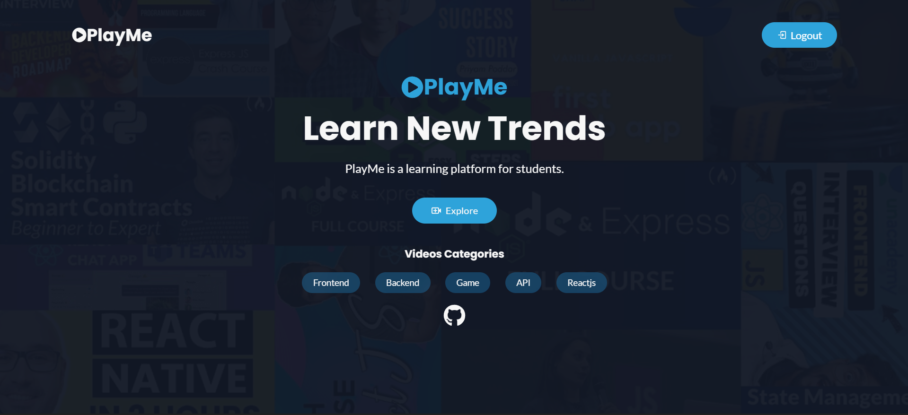
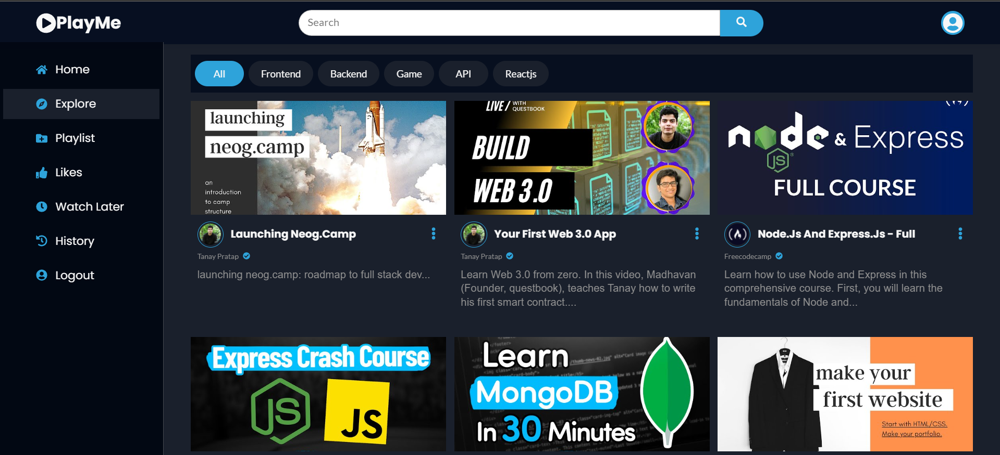
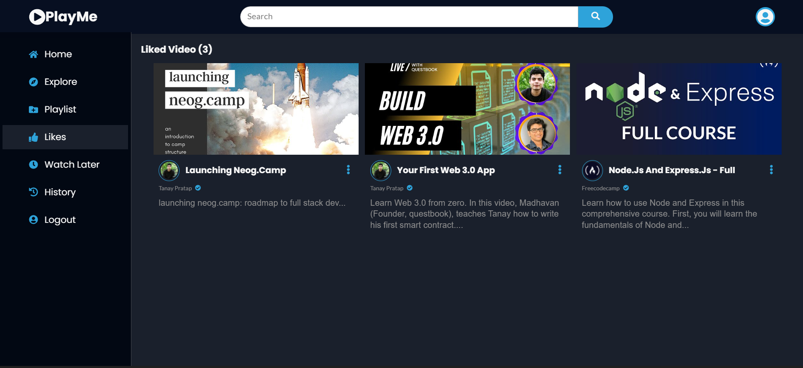
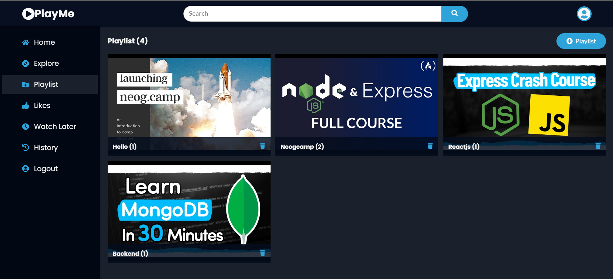
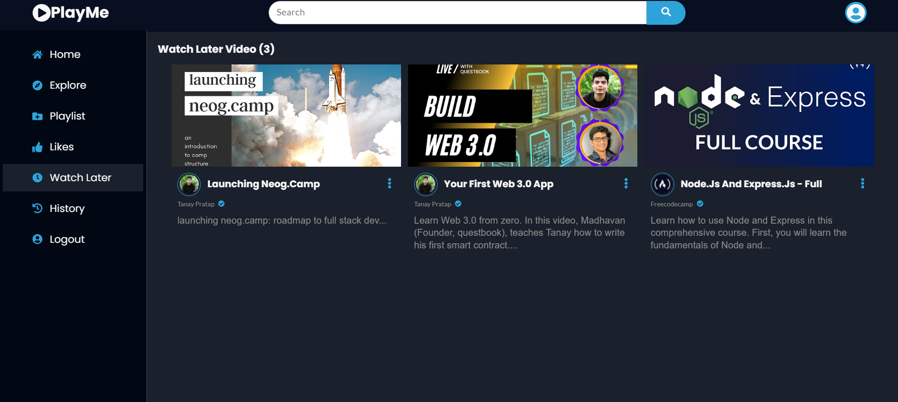
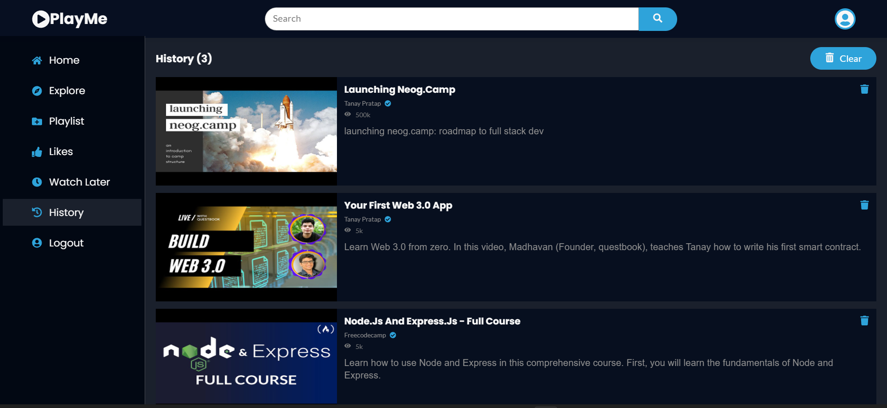

## [PlayMe - Video Library](https://playme-by-pritam.netlify.app/)

 PlayMe is Video library app for programming tutorial.   

### Tech Stack
- Reactjs
- Context API
- Reducer

### Demo 

  

### Features 

- Login Authentication
- Video like and disliked
- Categories
- Single video page
- Watch later
- Playlist management feature
- History management 
- Search video filter
- Notes for Particular video (Add and Delete)   

### Pages For video library 

####  Home  

####  Explore  

####  Liked Video Page  

####  Playlist Page  

####  Playlist Video Page   

####  Watch Later Page   

#### History Page   

